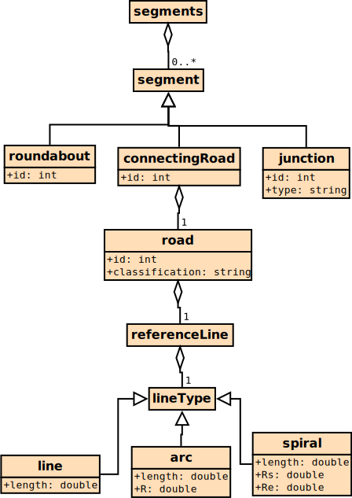
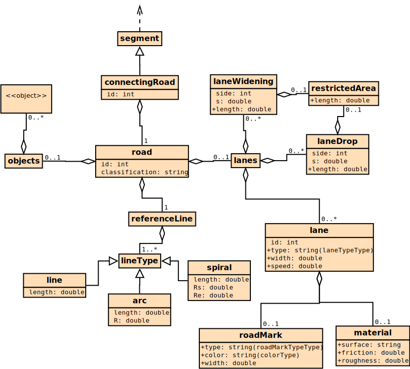
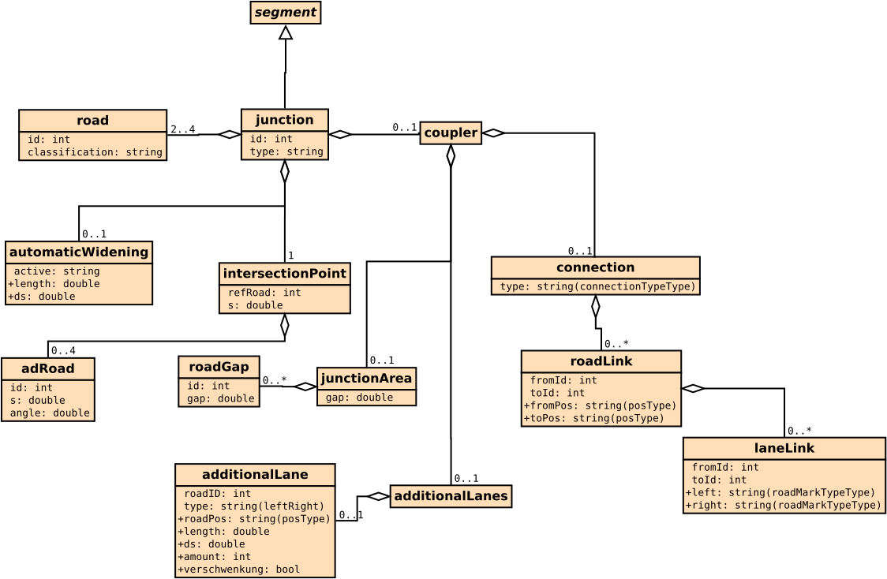
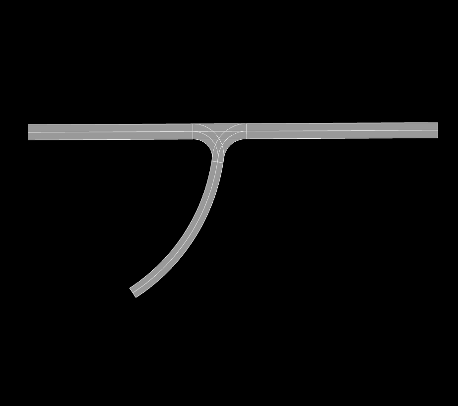
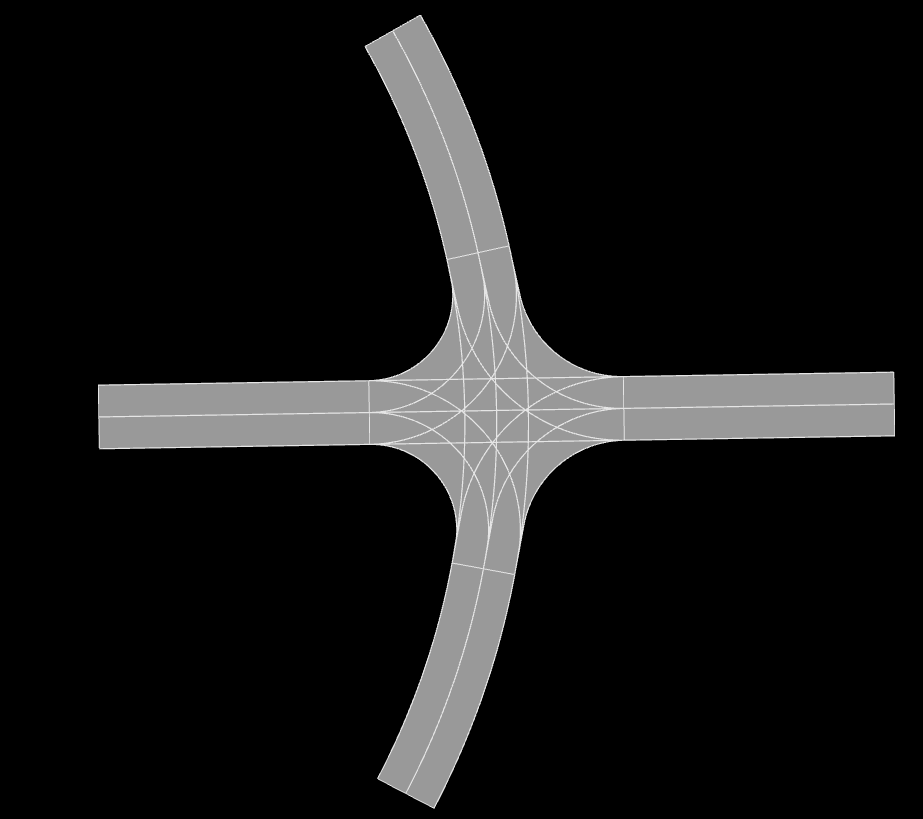
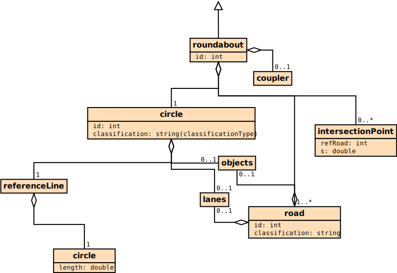
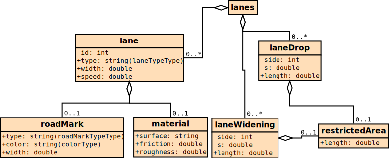

Input file format
=================

This section explains the input format and provides examples for basic usecases. Furthermore a variety of template files can be found in `io/Templates`. 

.. code-block:: xml

    <roadNetwork xmlns:xsi="http://www.w3.org/2001/XMLSchema-instance" xsi:noNamespaceSchemaLocation="../xml/input.xsd">
    	<segments>
            ...
    	</segments>
        <links refId="1" hdgOffset="0.0" xOffset="0" yOffset="0">
            ...
        </links>
        <closeRoads>
            ...
        </closeRoads>
    </roadNetwork>

Segments
--------

The *segments* node stores information about each physical road in the network as it's child nodes. Each segment represents a seperate road, roundabout or junction. The different types segments are outlined below.

ConnectingRoad
''''''''''''''

A connecting Road is used to represent a single street.

Road
^^^^

.. csv-table::
    :widths: 100 100 100 100 50

    **Name** , **Type** , **Range** , **Description** , **Required**
    id , int , positive , id of the road inside of the segment, yes
    classification , string , 'main' 'access' , set the road to main or access road , yes

LineType
^^^^^^^^

.. csv-table::
    :widths: 100 100 100 100 50

    **Name** , **Type** , **Range** , **Description** , **Required**
    length , double , positive , length of the reference line in m, yes
    R , double , positive , constant radius of the arc , yes
    Rs , double , positive , starting radius of the spiral , yes
    Re , double , positive , ending radius of the spiral , yes

Key points
^^^^^^^^^^

* Connecting roads are used for simple streets that are linked once at each endpoint at most
* The outermost ConnectingRoad element holds the ID in the segment namespace
* The road element holds an ID that is relative to the ConnectingRoad's ID. This is used to distinguish seperate parts of the same segment element
  

Junction
''''''''

Junction
^^^^^^^^^

.. csv-table::
    :widths: 100 100 100 100 50

    **Name** , **Type** , **Range** , **Description** , **Required**
    id , int , positive , id of the road inside of the segment, yes
    type , string , '2M' 'MA' 'M2A' '3A', type of junction , yes

AutomaticWidening
^^^^^^^^^^^^^^^^

.. csv-table::
    :widths: 100 100 100 100 50

    **Name** , **Type** , **Range** , **Description** , **Required**
    active , string , 'none' 'all' 'main' 'access' , specify where automatic widening is applied, yes
    length , double , positive , length of the additional lane, no
    double , double , positive , length of the transitioning part, no

IntersectionPoint
^^^^^^^^^^^^^^^^^

The intersection point stores information about the location and geometry about the point in which all roads meet. The reference road dictates the position of the junction.

.. csv-table::
    :widths: 100 100 100 100 50

    **Name** , **Type** , **Range** , **Description** , **Required**
    refRoad, int , positive , id of the reference road of the junction, yes
    s , string , positive, position of the junction in road direction , yes

RoadLink
^^^^^^^^

.. csv-table::
    :widths: 100 100 100 100 50

    **Name** , **Type** , **Range** , **Description** , **Required**
    fromId, int , positive , id of the fromRoad, yes
    toId, int , positive , id of the toRoad, yes
    fromPos , string , 'start' 'end', position of the fromRoad link , yes
    toPos , string , 'start' 'end', position of the toRoad link , yes

laneLink
^^^^^^^^

.. csv-table::
    :widths: 100 100 100 100 50

    **Name** , **Type** , **Range** , **Description** , **Required**
    fromId, int , positive , id of the fromLane , yes
    toId, int , positive , id of the toLane, yes
    left , string , 'solid' 'broken' 'none', lane marking on the left side, no
    right , string , 'solid' 'broken' 'none', lane marking on the right side, no

Key points
^^^^^^^^^^^

* Junctions need to be linked to the starting point of each adjacent road
* A junction must be used if more than two roads are linked to each other
* The intersection points of access roads need to be linked at their start or end positions
* Similar to the connecting road namespace, the junction ID is in the segment ID namespace and the road IDs are relative to the segment ID
  

Example
^^^^^^^

EXAMPLE

.. figure:: _static/M2A.png
    :class: align-right
    :width: 427

.. code-block:: xml

        <junction id="1" type="M2A">
        <road id="1" classification="main" >	
            <referenceLine>
                <line length="150"/>
            </referenceLine>
        </road>
        <road id="2" classification="access" >	
            <referenceLine>
                <line length="150"/>
            </referenceLine>
        </road>
        <road id="3" classification="access" >	
            <referenceLine>
                <line length="150"/>
            </referenceLine>
        </road>
        <intersectionPoint refRoad="1" s="75">
            <adRoad id="2" s="20" angle="-1.27"/>
            <adRoad id="3" s="20" angle="1.57"/>
        </intersectionPoint>
        <coupler>
            <junctionArea gap="10">
                <roadGap id="2" gap="15"/>
                <roadGap id="3" gap="15"/>
            </junctionArea>
        </coupler>
    </junction>

3A below

.. figure:: _static/3A.png
    :class: align-right
    :width: 427

.. code-block:: xml

    <junction id="1" type="3A">
        <road id="1" classification="access" >	
            <referenceLine>
                <spiral length="100"  Rs="-150" Re="0"/>
            </referenceLine>
        </road>
        <road id="2" classification="access" >	
            <referenceLine>
                <arc length="100"  R="-100"/>
            </referenceLine>
        </road>
        <road id="3" classification="access" >	
            <referenceLine>
                <arc length="100"  R="-100"/>
            </referenceLine>
        </road>
        <intersectionPoint refRoad="1" s="100">
            <adRoad id="2" s="0" angle="3.14"/>
            <adRoad id="3" s="0" angle="1.57079632679"/>
        </intersectionPoint>
        <coupler>
            <junctionArea gap="10">
                <roadGap id="2" gap="15"/>
            </junctionArea>
            <connection type="all"/>
        </coupler>
    </junction>

MA below

.. code-block:: xml

        <junction id="1" type="MA">
            <road id="1" classification="main" >	
                <referenceLine>
                    <line length="400"/>
                </referenceLine>
            </road>
            <road id="2" classification="access" >	
                <referenceLine>
                    <arc length="100"  R="-100"/>
                </referenceLine>
            </road>
            <intersectionPoint refRoad="1" s="200">
                <adRoad id="2" s="0" angle="-1.57"/>
            </intersectionPoint>
            <coupler>
                <junctionArea gap="10">
                    <roadGap id="2" gap="15"/>
                </junctionArea>
            </coupler>
        </junction>

2M below

.. code-block:: xml
    
        <junction id="1" type="2M">
        <road id="1" classification="main" >	
            <referenceLine>
                <line length="100"/>
            </referenceLine>
        </road>
        <road id="2" classification="main" >	
            <referenceLine>
                <arc length="100"  R="-100"/>
            </referenceLine>
        </road>
        <intersectionPoint refRoad="1" s="50">
            <adRoad id="2" s="50" angle="-1.57"/>
        </intersectionPoint>
        <coupler>
            <junctionArea gap="10">
                    <roadGap id="1" gap="15"/>
                <roadGap id="2" gap="20"/>
            </junctionArea>
        </coupler>
    </junction>

Roundabout
''''''''''

Represents a simple roundabout. The tool will generate several junctions belonging to a junction group in the output.

Circle
^^^^^^
.. csv-table::
    :widths: 100 100 100 100 50

    **Name** , **Type** , **Range** , **Description** , **Required**
    id, int , positive , id of the circle (usually 1) , yes
    classification, int , 'main' 'access' , sets the circular road of the rb to access or main road, yes

Reference Line
^^^^^^^^^^^^^^

.. csv-table::
    :widths: 100 100 100 100 50

    **Name** , **Type** , **Range** , **Description** , **Required**
    length, double , positive , length of the circular road in the roundabout , yes

Key points
^^^^^^^^^^^

* Roundabouts need to be linked to the starting point of each adjacent road
* Roundabouts will be represented by junctions in the open drive output

Example
^^^^^^^

.. code-block:: xml

    <roundabout id="1">
        <circle id="1" classification="access" >	
            <referenceLine>
                <circle length="320.5"/>
            </referenceLine>
            <lanes>
                    <lane id="1" type="delete" />
                    
                    <lane id="-3" type="driving">
                        <roadMark   type="solid" color="white" width="0.13"/>
                    </lane>
                    <lane id="-2" type="driving">
                        <roadMark   type="broken" color="white" width="0.13"/>
                    </lane>
                    <lane id="-1" type="driving">
                        <roadMark   type="broken" color="white" width="0.13"/>
                    </lane>
                    <lane id="0" type="driving" />
            </lanes>
        </circle>
        
        <road id="2" classification="access" >	
            <referenceLine>
                    <line length="150"/>
            </referenceLine>
        </road>
        <road id="3" classification="access" >	
            <referenceLine>
                    <line length="100"/>
            </referenceLine>
        </road>
        <road id="4" classification="access" >	
            <referenceLine>
                    <line length="100"/>
            </referenceLine>
        </road>
        <road id="5" classification="access" >	
            <referenceLine>
                    <line length="100"/>
            </referenceLine>
        </road>
        
        <intersectionPoint refRoad="1" s="80">
            <adRoad id="2" s="20" angle="-1.56"/>
        </intersectionPoint>
        <intersectionPoint refRoad="1" s="160">
            <adRoad id="3" s="20" angle="-1.56"/>
        </intersectionPoint>
        <intersectionPoint refRoad="1" s="240">
            <adRoad id="4" s="20" angle="-1.56"/>
        </intersectionPoint>
        <intersectionPoint refRoad="1" s="320">
            <adRoad id="5" s="20" angle="-1.6"/>
        </intersectionPoint>
        <coupler>
            <junctionArea gap="20">
            </junctionArea> 
        </coupler>
    </roundabout>

Lanes
-----

Lane
''''

.. csv-table::
    :widths: 100 100 100 100 50

    **Name** , **Type** , **Range** , **Description** , **Required**
    id, int , all , id of the lane , yes
    type, string , 'driving' 'restricted' 'none' 'delete', type of the lane , no
    width, double , positive , width of the lane , no
    speed, double , positive , speed limit of the lane , no

**Notes:**

* If no further lane information is provided a total of three default lanes will be generated. One in each direction and a dividing middle lane
* If at least one lane is provided no default lanes will be generated

RoadMark
''''''''

.. csv-table::
    :widths: 100 100 100 100 50

    **Name** , **Type** , **Range** , **Description** , **Required**
    type, int , 'solid' 'broken' 'none' , specifies the roadmark , no
    color, string , color , color of the roadmark , no
    width, double , positive , roadmark width , no

**Colors**:
'standard', 'blue', 'green', 'red', 'white', 'yellow', 'orange'.

LaneWidening and laneDrop
'''''''''''''''''''''''''''

.. csv-table::
    :widths: 100 100 100 100 50

    **Name** , **Type** , **Range** , **Description** , **Required**
    side, int , '-1' '1' , side of the lane that will be added/dropped , yes
    s, double , positive , starting position of the lane widening/drop , yes
    length, double , positive , length of the laneDrop , no

RestrictedArea
'''''''''''''''

.. csv-table::
    :widths: 100 100 100 100 50

    **Name** , **Type** , **Range** , **Description** , **Required**
    length, double , positive , length of the restricted area  of the lanewidening or lanedrop , no

**Note**: The length of the restricted area must be larger than the length of the lanewidening or the lanedrop. The starting position is inherited by the parent node.

Material
''''''''

.. csv-table::
    :widths: 100 100 100 100 50

    **Name** , **Type** , **Range** , **Description** , **Required**
    surface, string , surface material code depending on application, no
    friction, double , positive , friction coefficient , no
    roughness, double , positive ,roughness coefficient , no

Key points
'''''''''''

* Lane ids are centered around 0 and store their location relative to the driving direction. Positive ids are to the left of the driving direction and negative ids are on the right.
* Lanes from linked segments with the same ids are linked if not specified otherwise
* Lane ids are **not** exclusive

Example
''''''''

.. code-block:: xml

    <lanes>
        <lane id="-2" type="driving">
            <roadMark   type="solid" color="white" width="0.13"/>
        </lane>
        <lane id="-1" type="driving">
            <roadMark   type="broken" color="white" width="0.13"/>
        </lane>
        <lane id="0" type="driving" />
        <lane id="1" type="driving">
            <roadMark   type="solid" color="white" width="0.13"/>
        </lane>
        <laneDrop side="-1" s="100" length="50" />
    </lanes>

Linkage
-------

All links between segments are stored in a segmentLink element. Each segment is linked at their endpoint or their startpoint.

.. csv-table::
    :widths: 100 100 100 100 50

    **Name** , **Type** , **Range** , **Description** , **Required**
    fromSegment, int , positive , id of the firstSegment that will be linked , yes
    toSegment, int , positive , id of the toSegment that will be linked , yes
    fromRoad, int , positive , id of the specific road in the fromSegment that will be linked , yes
    toRoad, int , positive , id of the specific road in the toSegment that will be linked , yes
    fromPos, string , 'start' 'end' , specifies if the fromSegment should be linked at its beginning or end , yes
    toPos, string , 'start' 'end' , specifies if the toSegment should be linked at its beginning or end , yes

Key points
^^^^^^^^^^^

* Junctions and roundabouts need to be linked to the starting point of each adjacent road
* Segments have a seperate namespace from Roads, i.e. multiple roads with the ID 1 can exist under differen segments

Example
'''''''

.. code-block:: xml

    <links refId="1" hdgOffset="0.0" xOffset="0" yOffset="0">
        <segmentLink fromSegment="1" toSegment="2" fromRoad="1" toRoad="1" fromPos="end" toPos="start" />
        <segmentLink fromSegment="2" toSegment="3" fromRoad="1" toRoad="2" fromPos="end" toPos="end" />
        <segmentLink fromSegment="3" toSegment="4" fromRoad="3" toRoad="1" fromPos="end" toPos="start" />
        <segmentLink fromSegment="3" toSegment="5" fromRoad="4" toRoad="1" fromPos="end" toPos="end" />
        <segmentLink fromSegment="6" toSegment="1" fromRoad="2" toRoad="1" fromPos="end" toPos="start" />
    </links>

Closing the Network
-------------------

To smoothly close open connections, roads and their respective linkage information can automatically be generated. The syntax of closing roads is identical to the road links.

.. csv-table::
    :widths: 100 100 100 100 50

    **Name** , **Type** , **Range** , **Description** , **Required**
    fromSegment, int , positive , id of the firstSegment that will be linked , yes
    toSegment, int , positive , id of the toSegment that will be linked , yes
    fromRoad, int , positive , id of the specific road in the fromSegment that will be linked , yes
    toRoad, int , positive , id of the specific road in the toSegment that will be linked , yes
    fromPos, string , 'start' 'end' , specifies if the fromSegment should be linked at its beginning or end , yes
    toPos, string , 'start' 'end' , specifies if the toSegment should be linked at its beginning or end , yes

Example
'''''''

.. code-block:: xml

    <closeRoads>
            <segmentLink fromSegment="1" toSegment="2" fromRoad="1" toRoad="1" fromPos="end" toPos="end" />
            <segmentLink fromSegment="3" toSegment="3" fromRoad="5" toRoad="4" fromPos="end" toPos="end" />
            <segmentLink fromSegment="6" toSegment="5" fromRoad="1" toRoad="1" fromPos="end" toPos="end" />
            <segmentLink fromSegment="7" toSegment="1" fromRoad="4" toRoad="1" fromPos="end" toPos="start" />
            <segmentLink fromSegment="7" toSegment="7" fromRoad="2" toRoad="3" fromPos="end" toPos="end" />
    </closeRoads>